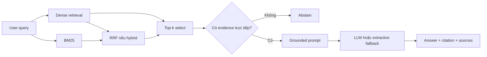

# Kiến trúc RAG - Day 08

## 1. Mục tiêu

Hệ thống là trợ lý nội bộ cho CS và IT Helpdesk, trả lời chính sách hoàn tiền, SLA, cấp quyền, FAQ và HR từ năm tài liệu đã kiểm soát. Câu trả lời chỉ dùng evidence được truy xuất, có citation và abstain khi không có dữ kiện trực tiếp.

```text
data/docs/*.txt
  -> preprocess metadata
  -> chunk theo heading/đoạn
  -> embedding local
  -> ChromaDB (rag_lab)
  -> dense hoặc hybrid retrieval
  -> grounded prompt
  -> LLM hoặc extractive fallback
  -> answer + sources + chunks_used
```

## 2. Indexing

| Tài liệu | Source metadata | Department | Số chunk theo cấu trúc mẫu |
|---|---|---|---:|
| `policy_refund_v4.txt` | `policy/refund-v4.pdf` | CS | 6 |
| `sla_p1_2026.txt` | `support/sla-p1-2026.pdf` | IT | 5 |
| `access_control_sop.txt` | `it/access-control-sop.md` | IT Security | 8 |
| `it_helpdesk_faq.txt` | `support/helpdesk-faq.md` | IT | 6 |
| `hr_leave_policy.txt` | `hr/leave-policy-2026.pdf` | HR | 5 |

Số trên được suy ra từ heading của corpus hiện tại; `index.py` in số thực tế khi chạy và là nguồn kiểm chứng cuối cùng.

| Quyết định | Giá trị | Lý do |
|---|---|---|
| Chunk size | 400 token ước lượng, tương đương 1.600 ký tự | Đủ chứa trọn một điều khoản ngắn |
| Overlap | 80 token ước lượng, tương đương 320 ký tự | Giữ ngữ cảnh khi section dài phải tách |
| Strategy | Heading -> paragraph -> sentence -> hard split | Ưu tiên ranh giới tự nhiên, tránh cắt giữa quy tắc |
| Metadata | `source`, `section`, `department`, `effective_date`, `access`, `chunk_index` | Citation, freshness, filter và debug |
| Chunk ID | SHA-256 của source + section + text | Upsert idempotent và prune vector cũ |

Embedding mặc định là `paraphrase-multilingual-MiniLM-L12-v2`, được chuẩn hóa vector và dùng giống nhau cho index/query. Vector store là ChromaDB persistent, collection `rag_lab`, khoảng cách cosine.

## 3. Retrieval

| Tham số | Baseline | Variant |
|---|---|---|
| `retrieval_mode` | `dense` | `hybrid` |
| `top_k_search` | 10 | 10 |
| `top_k_select` | 3 | 3 |
| Rerank | Tắt | Tắt |
| Biến thay đổi | - | Chỉ retrieval mode |

Dense tìm theo ngữ nghĩa. Hybrid hợp nhất cùng candidate budget dense/BM25 bằng Reciprocal Rank Fusion 0,6/0,4, rồi giữ chunk tốt nhất của mỗi domain suy ra từ chính query trước khi cắt top-k. Variant không đọc expected source; nó phù hợp vì corpus vừa có câu tự nhiên, vừa có exact term và câu multi-document như P1 + Access.

`rerank()` và `transform_query()` đã có implementation độc lập để mở rộng, nhưng không bật trong A/B hiện tại nhằm tuân thủ quy tắc chỉ đổi một biến.

## 4. Generation và abstain

- Provider được tự nhận diện từ `OPENAI_API_KEY` hoặc `GOOGLE_API_KEY`.
- OpenAI dùng model từ `LLM_MODEL`, temperature 0, tối đa 512 token.
- Khi không có key hoặc provider lỗi, fallback chỉ trích các dòng liên quan trong context và vẫn gắn citation.
- Query chứa tín hiệu quan trọng không xuất hiện trong evidence, như `ERR-403-AUTH` hoặc thông tin mức phạt, bị chặn trước generation và trả `Không đủ dữ liệu trong tài liệu hiện có.`
- Kết quả public gồm `answer`, `sources`, `chunks_used`, `query`, `config`.

## 5. Evaluation

`eval.py` chạy cùng 10 câu hỏi cho baseline và variant, sinh:

- `results/scorecard_baseline.md`;
- `results/scorecard_variant.md`;
- `results/ab_comparison.csv`;
- `logs/grading_run.json` khi truyền `--grading`.

Bốn metric tự động là faithfulness, answer relevance, context recall và completeness. Đây là heuristic token coverage để so sánh ổn định; grading criteria và các câu nhạy cảm vẫn cần người đọc xác nhận.

## 6. Failure flow



Debug theo thứ tự: metadata/chunk -> expected source trong top-k -> prompt/citation -> scorecard. Khi đổi embedding model phải xóa hoặc rebuild collection để tránh khác dimension.
