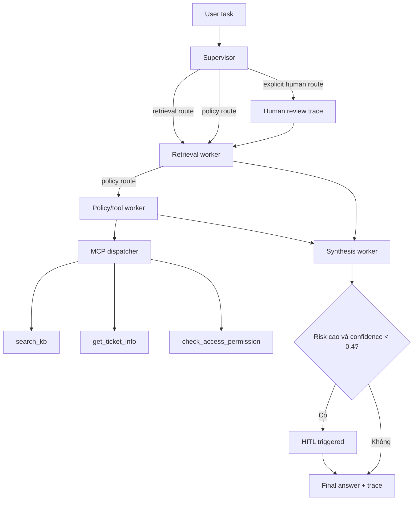

# Kiến trúc Supervisor-Worker - Day 09

## 1. Tổng quan

Hệ thống tách quyết định luồng, truy xuất, phân tích policy/tool và tổng hợp thành các thành phần có contract riêng. Supervisor chỉ phân loại intent/risk; mọi câu trả lời cuối đều đi qua retrieval và synthesis, còn policy worker chỉ được thêm khi task chứa access hoặc ngoại lệ chính sách.

## 2. Thành phần

### Supervisor (`graph.py`)

- Input: `task`.
- Output: `supervisor_route`, `route_reason`, `risk_high`, `needs_tool`.
- Route policy khi có `cấp quyền`, `access`, `Level`, `contractor`, `Flash Sale`, sản phẩm số, store credit hoặc temporal policy signal.
- Route retrieval cho câu tra cứu thông thường, gồm refund window và SLA.
- Gắn risk cho P1, emergency, 2am, production và mã `ERR-*`.
- Không chứa câu trả lời domain và không gọi LLM.

### Retrieval worker (`workers/retrieval.py`)

- Tự đọc đủ năm tệp trong `data/docs`, chunk theo heading, upsert snapshot vào `day09_docs` và prune ID cũ.
- Dùng `all-MiniLM-L6-v2` mặc định cho cả index và query; có thể đổi bằng `EMBEDDING_MODEL`.
- Query toàn snapshot nhỏ, giữ chunk tốt nhất của mỗi domain suy ra trực tiếp từ task rồi lấp top-k theo dense rank; không đọc expected source.
- Top-k mặc định lấy từ `RETRIEVAL_TOP_K`, hiện khuyến nghị 5 để câu multi-document có đủ SLA và access evidence.
- Không dùng random embedding và không tạo fake chunk khi lỗi.

### Policy/tool worker (`workers/policy_tool.py`)

- Phát hiện Flash Sale, digital product, activated product và đơn trước ngày hiệu lực v4.
- Với route policy, gọi `search_kb` qua MCP và hợp nhất evidence không trùng.
- Với Level 1-3, gọi `check_access_permission`; khi câu hỏi có timestamp ticket thì có thể gọi `get_ticket_info`.
- Mọi call có `tool`, `input`, `output`, `error`, `timestamp` trong `mcp_tools_used`.

### Synthesis worker (`workers/synthesis.py`)

- Đọc `retrieved_chunks` và `policy_result`, không tự retrieve.
- Prompt evidence-only, yêu cầu citation số `[1]`, `[2]` và abstain.
- Tự nhận OpenAI/Gemini khi có key; nếu không có key dùng extractive fallback từ chính evidence.
- Confidence dựa trên score evidence, policy decision và trạng thái abstain. Risk cao với confidence dưới 0,4 kích hoạt HITL trace.

### MCP server (`mcp_server.py`)

| Tool | Input chính | Output |
|---|---|---|
| `search_kb` | `query`, `top_k` | chunks, sources, total_found |
| `get_ticket_info` | `ticket_id` | ticket/SLA/notification mock có kiểm soát |
| `check_access_permission` | level, role, emergency | approvers, override, notes |
| `create_ticket` | priority, title, description | ticket mock deterministic |

Đây là mức Standard in-process dispatcher theo rubric. `search_kb` dùng retrieval thật; khi retrieval lỗi, tool trả error và danh sách rỗng thay vì dựng evidence giả.

## 3. Shared state

| Nhóm field | Field tiêu biểu | Owner ghi |
|---|---|---|
| Input/route | `task`, `supervisor_route`, `route_reason`, `risk_high`, `needs_tool` | caller/supervisor |
| Evidence | `retrieved_chunks`, `retrieved_sources` | retrieval/policy |
| Policy/tool | `policy_result`, `mcp_tools_used` | policy worker |
| Output | `final_answer`, `sources`, `confidence`, `hitl_triggered` | synthesis/HITL |
| Trace | `run_id`, `timestamp`, `workers_called`, `worker_io_logs`, `history`, `latency_ms` | toàn graph |

Contract chi tiết và trạng thái implementation nằm trong `contracts/worker_contracts.yaml`.

## 4. Vì sao dùng Supervisor-Worker

| Tiêu chí | Single RAG Day 08 | Supervisor-Worker Day 09 |
|---|---|---|
| Xác định lỗi | Phải lần theo retrieval/generation | Trace chỉ rõ route, worker và I/O |
| Policy exception | Nằm chung trong prompt | Worker/rule riêng, test độc lập |
| External capability | Hard-code lời gọi | MCP dispatcher và schema |
| Thay retrieval | Sửa pipeline chung | Thay retrieval worker |
| Chi phí | Một generation call | Một generation call, cộng tool khi cần |

## 5. Giới hạn

1. Routing hiện là rule-based; query dùng từ đồng nghĩa hoàn toàn mới có thể đi nhầm route.
2. MCP là in-process mock ở mức Standard, chưa có transport, auth và timeout mạng.
3. Confidence là heuristic, không phải xác suất đã hiệu chỉnh; HITL thật cần cơ chế pause/resume và người phê duyệt.
4. Lần chạy đầu cần tải embedding model nếu máy chưa có cache.
