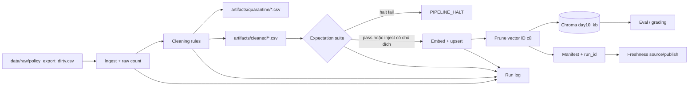

# Kiến trúc Data Pipeline - Day 10

## 1. Luồng dữ liệu

`run_id` liên kết log, cleaned CSV, quarantine CSV, metadata vector và manifest. Freshness đo tuổi source bằng `latest_exported_at`, đồng thời ghi tuổi publish từ `published_at` để phân biệt source cũ với pipeline vừa chạy.

## 2. Ranh giới trách nhiệm

| Thành phần | Input | Output | Trách nhiệm |
|---|---|---|---|
| Ingest | CSV UTF-8 | list raw row, `raw_records` | Đọc nguyên trạng, không sửa dữ liệu |
| Transform | raw rows + cutoff env | cleaned rows, quarantine reason | Normalize, version filter, semantic conflict, dedupe |
| Quality | cleaned snapshot | expectation results + halt flag | Chặn schema/source/version vi phạm contract |
| Embed | cleaned CSV | snapshot `day10_kb` | Upsert stable `chunk_id`, prune ID không còn hợp lệ |
| Monitor | manifest | PASS/WARN/FAIL + boundary ages | Phát hiện source stale, timestamp thiếu/sai/future |
| Eval | Chroma snapshot + golden questions | CSV/JSONL evidence | Kiểm expected, forbidden và top-1 doc |

## 3. Cleaning và quarantine

Nguồn hợp lệ gồm refund, SLA, helpdesk, HR và access control. Record bị quarantine khi nguồn lạ, ngày không parse được, version trước cutoff, text rỗng/mơ hồ, semantic HR 2025 hoặc trùng sau normalize. Refund 14 ngày được đổi thành 7 ngày ở run chuẩn; cờ `--no-refund-fix` giữ corruption để tạo before evidence.

Quarantine là artifact có lý do, không phải xóa im lặng. Việc đưa record trở lại cần sửa source/cutoff/rule, peer review và chạy lại expectation; không sửa trực tiếp cleaned CSV.

## 4. Idempotency và publish snapshot

`chunk_id` là SHA-256 rút gọn của `doc_id + normalized chunk_text`, nên cùng một nội dung luôn có cùng ID dù thứ tự raw thay đổi. Pipeline dùng `upsert`, sau đó lấy ID hiện có và xóa mọi ID không thuộc cleaned run. Vì vậy rerun không làm phình collection và record từng bị hợp lệ nhưng nay bị quarantine không còn tồn tại trong serving snapshot.

## 5. Retrieval phục vụ grading

Eval search toàn snapshot nhỏ bằng semantic similarity, sau đó rerank theo lexical coverage và domain signal suy ra từ câu hỏi. Rerank không đọc `expect_top1_doc_id`; trường expected chỉ dùng sau retrieval để chấm. Cách này ổn định hơn cho tiếng Việt, email, số, `P1`, `Level 4` và tên bộ phận.

## 6. Liên hệ Day 09

Day 09 và Day 10 dùng corpus nghiệp vụ giống nhau nhưng collection tách biệt (`day09_docs`, `day10_kb`) để bài orchestration không bị thay đổi ngoài ý muốn khi inject corruption Day 10. Trong triển khai thật, Day 09 retrieval worker nên trỏ sang collection đã publish của Day 10 hoặc dùng alias collection được đổi atomically sau khi expectation pass.

## 7. Rủi ro còn lại

- CSV mẫu có timestamp cũ so với ngày chạy nên freshness có thể FAIL dù code đúng; đây là data incident cần ghi nhận.
- Cutoff lấy từ env và contract nhưng chưa có registry/version API trung tâm.
- Chroma local chưa có transaction xuyên suốt cleaned artifact và vector publish.
- Domain rerank là rule-based; domain mới cần cập nhật classifier hoặc chuyển sang multilingual reranker đã đánh giá.
